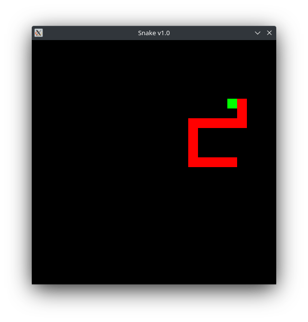

# Snake
Simple Snake clone
# 
# Requirements
Here is a list of what you need to install before building on linux:
* git
* cmake
* make
* freetype
* x11
* xrandr
* udev
* opengl
* flac
* ogg
* vorbis
* vorbisenc
* vorbisfile
* openal
* pthread

More information about building SFML library, you can find [here](https://www.sfml-dev.org/tutorials/2.5/compile-with-cmake.php).

# Build
```bash
git clone --recursive git@github.com:krzgr/Snake.git

cd build
cmake -DBUILD_SHARED_LIBS=OFF -DSFML_USE_STATIC_STD_LIBS=ON ..
make
```
Executable will appear in the **bin** directory.